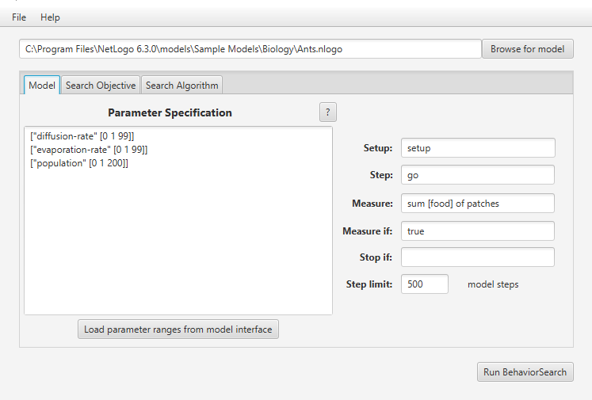
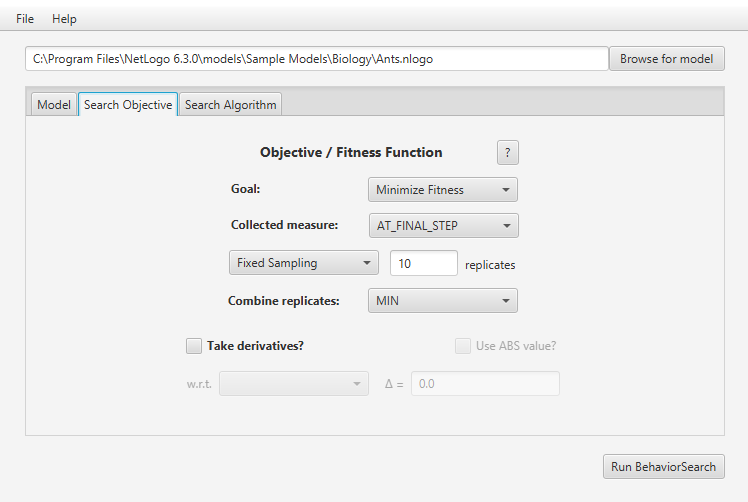
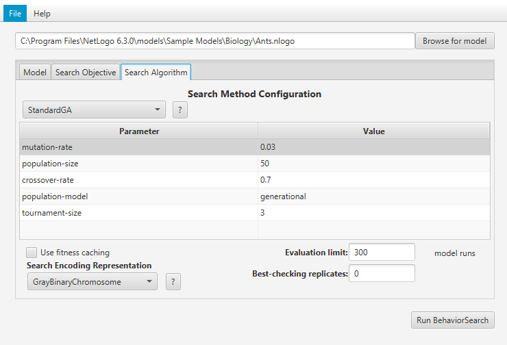
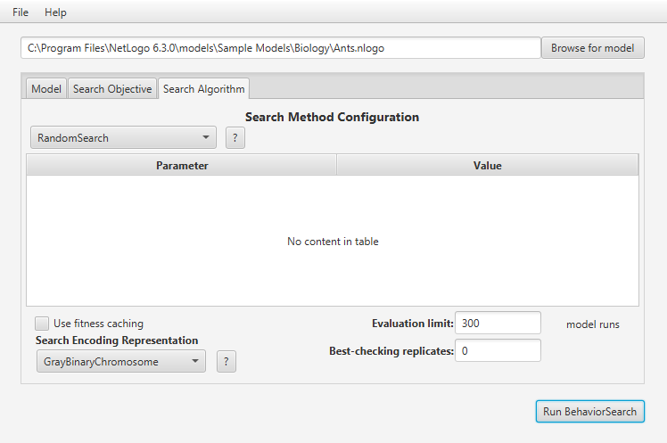
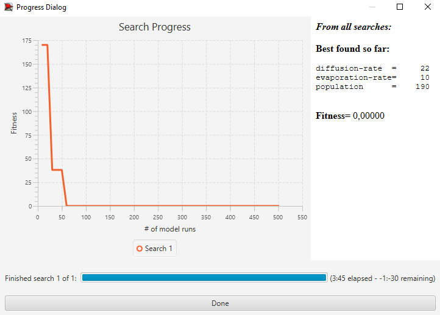
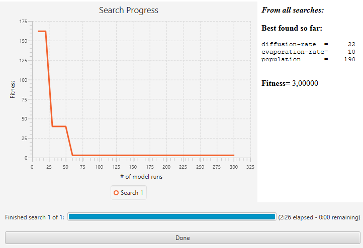

## Комп'ютерні системи імітаційного моделювання

## СПм-22-5, **Снігур Антон Русланович**

### Лабораторна робота №**3**. Використання засобів обчислювального интелекту для оптимізації імітаційних моделей

 

### Варіант 10, модель у середовищі NetLogo:

[Ants](https://www.netlogoweb.org/launch#http://www.netlogoweb.org/assets/modelslib/Sample%20Models/Biology/Ants.nlogo)

 

#### Вербальний опис моделі:

Вербальний опис моделі наведено у [лабораторній роботі №1](../lr1/README.md).

#### Керуючі параметри:

- **population** визначає кількість агентів у середовищі моделювання, тобто, в даній моделі, кількість мурах.
- **diffusion-rate** визначає швидкість дифузії хімічної речовини.
- **evaporation-rate** визначає швидкість випаровування хімічної речовини.

#### Показники роботи моделі:

- кількість їжі у купі, що розташована найближче до гнізда
- кількість їжі у купі, що розташована найдальше від гнізда
- кількість їжі у купі, що розташована на середній відстані до гнізда
- загальна кількість їжі на усіх джерелах (даний показник був доданий для проведення досліджень)

 

### Налаштування середовища BehaviorSearch:

**Обрана модель**:

<pre>
C:\Program Files\NetLogo 6.3.0\models\Sample Models\Biology\Ants.nlogo
</pre>

**Параметри моделі** (вкладка Model):

<pre>
["diffusion-rate" [0 1 99]]
["evaporation-rate" [0 1 99]]
["population" [0 1 200]]
</pre>

Використовувана **міра**:  
Для фітнес-функції було обрано **значення загальної кількості їжі на усіх джерелах** та вказано у параметрі "**Measure**":

<pre>
sum [food] of patches
</pre>

Значення загальної кількості їжі на усіх джерелах має враховуватися **наприкінці** симуляції, адже нас цікавить скільки іжі залишиться після завершення симуляції.

Параметр зупинки за умовою ("**Stop if**") не використовувався.  
Загальний вигляд вкладки налаштувань параметрів моделі:  

**Налаштування цільової функції** (вкладка Search Objective):  
Метою підбору параметрів імітаційної моделі, що описує рух мурах, є **мінімізація** значення загальної кількості їжі на усіх джерелах – це вказано через параметр "**Goal**" зі значенням **Minimize Fitness**. Тобто необхідно визначити такі параметри налаштувань моделі, при яких найшвидше досягається спустошення усіх джерел їжі. У даній ситуації нас цікавить значення загальної кількості їжі наприкінці симуляції. Для цього у параметрі "**Collected measure**", що визначає спосіб обліку значень обраного показника, вказано **AT_FINAL_STEP**.  
Щоб уникнути викривлення результатів через випадкові значення, що використовуються в логіці самої імітаційної моделі, **кожна симуляція повторюється по 10 разів**, результуюче значення - **мінімальне**.
Загальний вигляд вкладки налаштувань цільової функції:  

**Налаштування алгоритму пошуку** (вкладка Search Algorithm):  
Загальний вид вкладки налаштувань генетичного алгоритму:  

Загальний вид вкладки налаштувань випадкового пошуку:  

 

### Результати використання BehaviorSearch:

Діалогове вікно запуску пошуку:  

Результат пошуку параметрів імітаційної моделі, використовуючи **генетичний алгоритм**:  

Результат пошуку параметрів імітаційної моделі, використовуючи **випадковий пошук**:  

